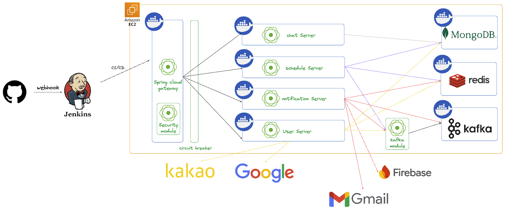
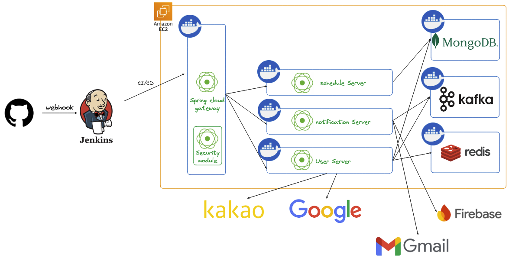
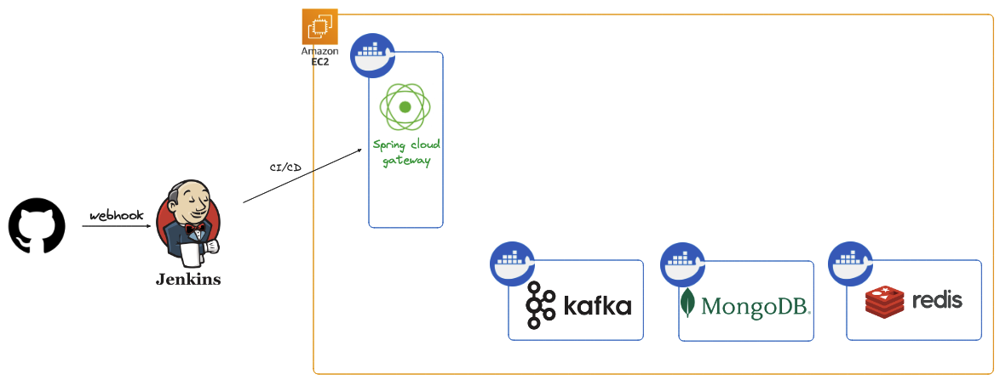

# Toge-do
### 친구와 일정을 공유 할 수 있는 일정관리 플랫폼입니다.

---

### 개발 기간
##### 2024.12.01 ~

---

### 개발자
##### 프론트엔드: [도안탄히엔](https://github.com/thanhhien234)
##### 백엔드: [한승규](https://github.com/Seungkyu-Han)

---
### 기술 스택
##### 프론트엔드

##### 백엔드

  

##### DEVOPS

---
### 데이터베이스 설계(2025.01.21)
##### MongoDB

---
### 사용한 아키텍쳐(2025.01.23)
##### Hexagonal Architecture

---
### 기록
##### 스프린트 12 (redis module 리펙토링)
기간: 2025.01.20-2025.01.22

- redis module 리펙토링

 

##### 스프린트 11 (model module 리펙토링)
기간: 2025.01.07-2025.01.15

- model module 리펙토링

 

##### 스프린트 10 (security module 리펙토링)
기간: 2025.01.05-2025.01.05

- security module 리펙토링

 

##### 스프린트 9 (kafka module 리펙토링)
기간: 2025.01.04-2024.01.05

- kafka service 멀티 모듈로 교체
- kafka module 테스트 코드 추가

 

##### 스프린트 8 (그룹 채팅)
기간: 2025.01.01-2024.01.03

- 채팅 서버 배포 설정
- 그룹 채팅방에 채팅 생성
- 그룹 채팅방에 채팅 구독

 

##### 스프린트 7 (그룹 일정 생성)
기간: 2024.12.27-2024.12.31

- 그룹 일정 생성
- 그룹 일정에 본인의 일정을 업로드
- 그룹 일정에서 본인의 일정을 수정
- 그룹 일정에서 본인의 일정을 삭제
- 그룹 일정 확정 요청
- 그룹 일정 확정 승인
- 그룹 일정 확정 취소

 

##### 스프린트 6 (그룹 생성)
기간: 2024.12.24-2024.12.26

- 친구를 초대하여 그룹을 생성
- 해당 그룹을 수정
- 본인이 속한 그룹들을 조회
- 그룹에서 탈퇴
- 그룹에 초대되면 알림을 전송

 

##### 스프린트 5-1 (개인 일정 리펙토링)
기간: 2024.12.21 - 2024.12.23

- 개인 일정 통합 리펙토링
- 개인 일정 서비스 테스트
- 개인 일정을 Redis를 사용하여 응답속도 개선

 

##### 스프린트 5 (개인 유동 일정 관리 서비스 개발)
기간: 2024.12.18 - 2024.12.20

- 개인 유동 일정 업로드 기능
- 개인 유동 일정 수정 기능
- 개인 유동 일정 삭제 기능

 

##### 스프린트 4-1 (Gateway에 Circuit Breaker 설정)
기간: 2024.12.16 - 2024.12.16

- Gateway에 장애 전파 방지를 위한 Circuit Breaker 설정

 

##### 스프린트 4 (개인 고정 일정 관리 서비스 개발)
기간: 2024.12.15 - 2024.12.17

- 개인 고정 일정 업로드 기능
- 개인 고정 일정 수정 기능
- 개인 고정 일정 삭제 기능

 

##### 스프린트 3 (알림 기능 개발)
기간: 2024.12.12 - 2024.12.14

- notification 서버에서 SSE API를 사용해 사용자에게 실시간 알림 기능 구현
- notification 서버와 FCM을 연동하여 앱이 실행 중이지 않은 상태에서도 사용자에게 알림 기능 구현

 

##### 스프린트 2-1 (Gateway에 Security 설정)
기간: 2024.12.11 - 2024.12.11

- Gateway에 Security를 설정하고, Filter로 헤더에서 토큰 추출

 

##### 스프린트2 (친구 기능 개발)
기간: 2024.12.08 - 2024.12.10

- 친구 조회
- 친구 신청(이메일 and QR코드)
- 친구 삭제

 

##### 스프린트1 (유저 기능 개발)
기간: 2024.12.01 - 2024.12.07

- 카카오 로그인
- 카카오 회원가입
- ~~네이버 로그인~~ 구글 로그인으로 변경
- ~~네이버 회원가입~~ 구글 회원가입으로 변경
- 사용자 정보 수정
- 인증 메일 발송
- 이메일 유효성 검사
- 사용자 정보 수정

 

##### INTRO (초기 세팅)

- 개발 환경 구성
- Spring Cloud Gateway 설정
- Jenkins를 사용한 CI/CD 구성

